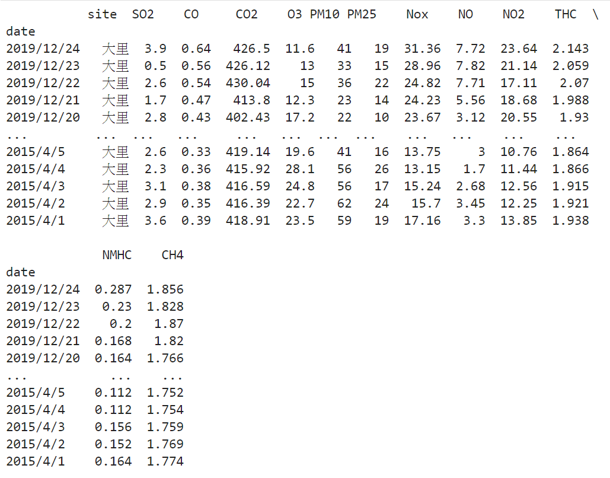

# Air-Quality-Data-analysis

## Data is from Environmental Protection Administration Executive Yuan, R.O.C(Taiwan)
* https://erdb.epa.gov.tw/DataRepository/EnvMonitor/AirQualityMonitorDayData.aspx?topic1=%E5%A4%A7%E6%B0%A3&topic2=%E7%92%B0%E5%A2%83%E5%8F%8A%E7%94%9F%E6%85%8B%E7%9B%A3%E6%B8%AC&subject=%E7%A9%BA%E6%B0%A3%E5%93%81%E8%B3%AA

## First step 
### in this case we use python and import model
* Pandas for use Dataframe
````py
import Pandas as pd
````
* matplotlib.pyplot for datavisualization
````py
import Pandas as pd
````

* seaborn for more beautful and powerful python data visualization tool 
** if you never installed seaborn in your computer use
````cmd
pip install seaborn
````
to install seaborn

### load Air data. In this Case,we choosed date from 2010/01/01 to 2019/12/31. And drop null or error data rows.

 